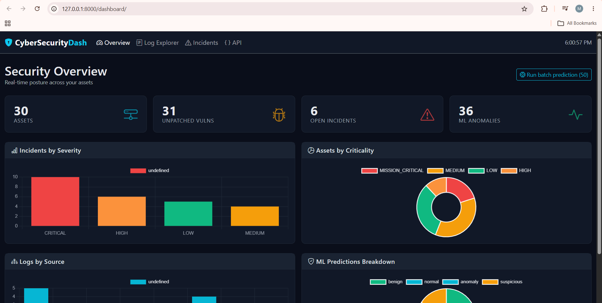

# CyberSecurityDashboard



A Django + DRF + scikit-learn cybersecurity monitoring dashboard.

- **7 domain models** — Assets, Threats, Vulnerabilities, Incidents, Logs, ML Models, Predictions
- **Full REST API** with filtering, search, pagination
- **ML pipeline** — IsolationForest anomaly detector + RandomForest intrusion classifier
- **Dark dashboard UI** — Overview KPIs, Chart.js visualizations, Log Explorer with live "Predict" buttons
- **Docker-ready** — one command to run locally with Postgres + Redis
- **48 pytest tests** across models, serializers, API, and ML

---

## Quickstart (Docker — recommended)

```bash
git clone https://github.com/mxolisi78/CyberSecurityDashboard.git
cd CyberSecurityDashboard
cp .env.example .env
docker compose up --build
```

Then, in another terminal:

```bash
docker compose exec web python manage.py createsuperuser
docker compose exec web python manage.py seed_data --reset
docker compose exec web python -m ml.train
```

Open:
- Dashboard: <http://localhost:8000/dashboard/>
- API root: <http://localhost:8000/api/>
- Admin: <http://localhost:8000/admin/>

---

## Quickstart (local, no Docker)

```bash
python -m venv venv
# Windows: venv\Scripts\activate
# macOS/Linux: source venv/bin/activate

pip install -r requirements.txt
cp .env.example .env
python manage.py migrate
python manage.py seed_data --reset
python -m ml.train
python manage.py runserver
```

---

## Architecture

```
config/         Django project (split settings: base/dev/prod)
security/       Main app: models, serializers, views, dashboard URLs
ml/             Feature engineering, training, inference
templates/      HTML templates (base + dashboard/*)
static/         CSS + JS
tests/          Pytest suite (48 tests)
docker/         Container entrypoint
```

---

## API endpoints

| Method | URL | Description |
|---|---|---|
| GET | `/api/dashboard/summary/` | Dashboard counts |
| GET/POST | `/api/assets/` | Assets CRUD |
| GET/POST | `/api/threats/` | Threats CRUD |
| GET/POST | `/api/vulnerabilities/` | Vulnerabilities CRUD |
| GET/POST | `/api/incidents/` | Incidents CRUD |
| GET/POST | `/api/logs/` | Logs CRUD |
| GET/POST | `/api/ml-models/` | ML model registry |
| GET/POST | `/api/predictions/` | Predictions |
| POST | `/api/logs/{id}/predict/` | Score one log |
| POST | `/api/logs/predict-batch/?limit=50` | Score N unprocessed logs |

All list endpoints support `?search=`, `?ordering=`, and per-resource filters.

---

## Testing

```bash
pytest
```

## ML pipeline

```bash
python -m ml.train
```

Produces `ml/artifacts/anomaly_detector.joblib` and `intrusion_classifier.joblib`
and registers them in the `MLModel` table.

**Latest training results:** 96% accuracy, 0.966 F1 on the synthetic intrusion classifier.

---

## License

MIT — see [LICENSE](LICENSE).